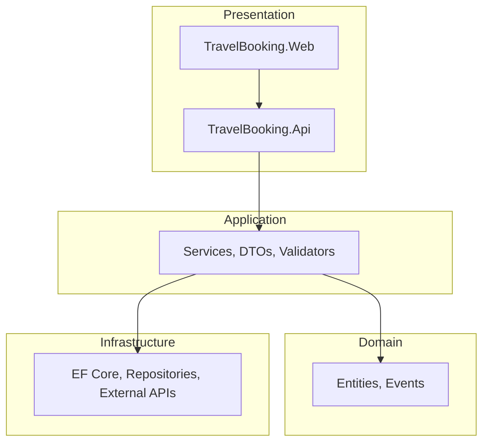

# TravelBooking (FlyNow)

> Uçuş, otel, araç kiralama ve tur paketleri için full-stack rezervasyon platformu. ASP.NET Core 9, Clean Architecture. 60 saniyede keşfet.

## What it is

TravelBooking, uçuş arama/rezervasyon, otel, araç kiralama ve tur paketleri sunan seyahat platformudur. Stripe ödeme, JWT auth, admin paneli ve harici uçuş API entegrasyonu içerir.

## Features

### Müşteri
- Uçuş arama, otel, araç kiralama, tur paketleri
- Kullanıcı kayıt, email doğrulama, şifre sıfırlama
- Stripe ödeme, çoklu para birimi
- Rezervasyon geçmişi, responsive UI

### Admin
- Kullanıcı, rezervasyon, uçuş yönetimi
- İstatistik dashboard, iletişim mesajları

### API
- Clean Architecture, JWT + Refresh token
- Rate limiting, Polly resilience, Health checks
- Swagger/OpenAPI

## Tech Stack

- **API:** ASP.NET Core 9, C# 13, EF Core 9
- **Web:** ASP.NET Core MVC 9, Razor, Bootstrap 5
- **Database:** SQL Server
- **Auth:** Identity, JWT Bearer
- **Payments:** Stripe
- **Resilience:** Polly

## Architecture



## Run Locally

### Manuel Kurulum

```bash
git clone https://github.com/dugerdev/TravelBooking.git
cd TravelBooking
```

**API** `API/TravelBooking/TravelBooking.Api/appsettings.json` – ConnectionStrings, JWT, Email

**Web** `UI/TravelBooking.Web/TravelBooking.Web/appsettings.json` – ApiSettings.BaseUrl

```bash
cd API/TravelBooking/TravelBooking.Api
dotnet ef database update
dotnet run
```

İkinci terminalde:

```bash
dotnet run --project UI/TravelBooking.Web/TravelBooking.Web
```

- **Web UI:** https://localhost:7208
- **Swagger:** https://localhost:7283/swagger

### Varsayılan Admin

| Email | Şifre |
|-------|-------|
| admin@travelbooking.com | Admin123!ChangeMe |

## Live Preview

🔗 [Demo](https://github.com/dugerdev/TravelBooking) *(deploy URL eklenebilir)*

## Test / CI

- **Test:** `dotnet test`
- **CI:** GitHub Actions

## Repo Hijyeni

- [x] `.env.example` – Ortam değişkenleri şablonu
- [x] `LICENSE` – Lisans dosyası
- [x] `.gitignore`

---

## .env.example

`.env.example` proje kökünde. Docker/CI için:

```
ConnectionStrings__DefaultConnection=Server=(localdb)\\mssqllocaldb;Database=TravelBookingDb;Trusted_Connection=true;TrustServerCertificate=true
JWT__Secret=min-32-char-secret
ApiSettings__BaseUrl=https://localhost:7283
ASPNETCORE_ENVIRONMENT=Development
```

## License

MIT License – [LICENSE](LICENSE)
